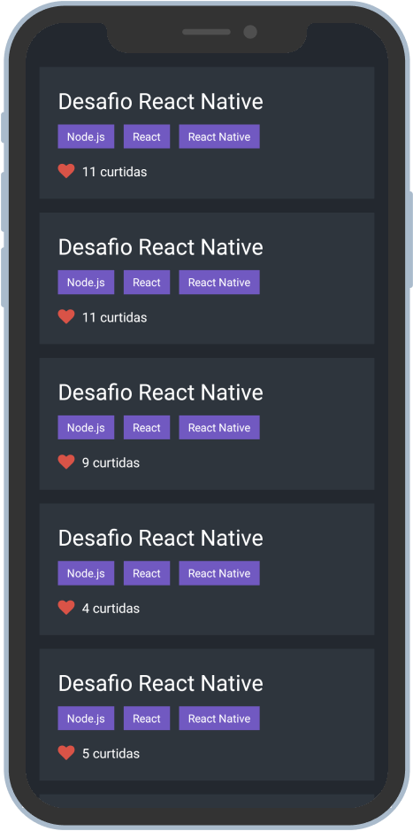

  

<h4 align="center">
   Conceitos do React Native
</h4>

  
  
  
  
  

  
  
  
  
  

   

  <a href="#rocket-technologies">Technologies</a>&nbsp;&nbsp;&nbsp;|&nbsp;&nbsp;&nbsp;
  <a href="#information_source-how-to-use">How To Use</a>&nbsp;&nbsp;&nbsp;|&nbsp;&nbsp;&nbsp;
  <a href="#memo-license">License</a>

  

## :rocket: Technologies

This project was developed based on the challenge about React Native Concepts in the GoStack by [Rocketseat](https://rocketseat.com.br/) with the following technologies:

- [React Native](https://reactnative.dev/)
- [Axios](https://github.com/axios/axios)
- [React Native Vector Icons](https://github.com/oblador/react-native-vector-icons#readme)
- [Jest](https://jestjs.io/)

## :memo: License

This project is under the MIT license. See the [LICENSE](https://github.com/gfgabrielfranca/be-the-hero/blob/master/LICENSE) for more information.

---

Made with ♥ by Gabriel França :wave: [Get in touch!](https://www.linkedin.com/in/gabriel-fran%C3%A7a-653058146/)

[nodejs]: https://nodejs.org/
[axios]: https://github.com/axios/axios#readme
